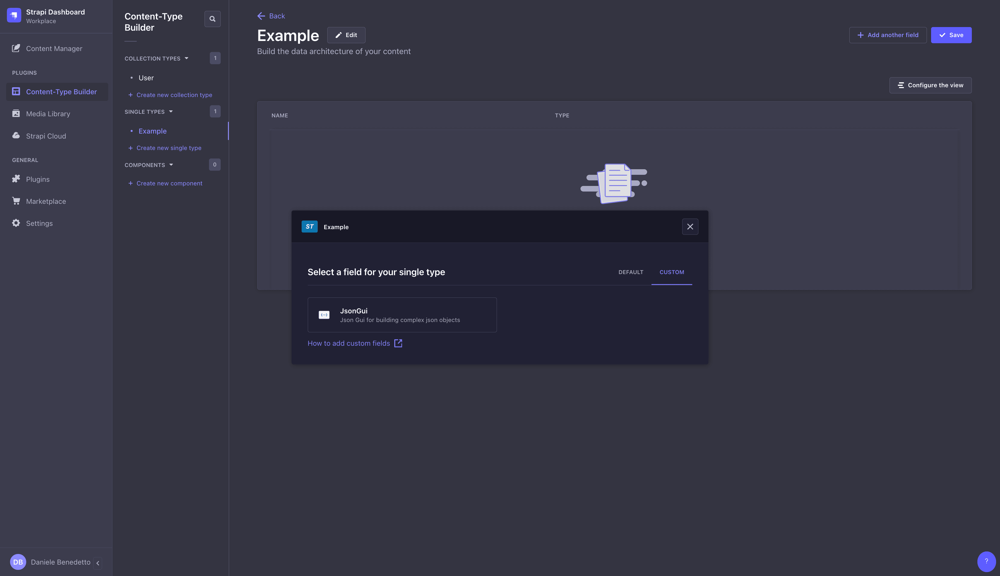
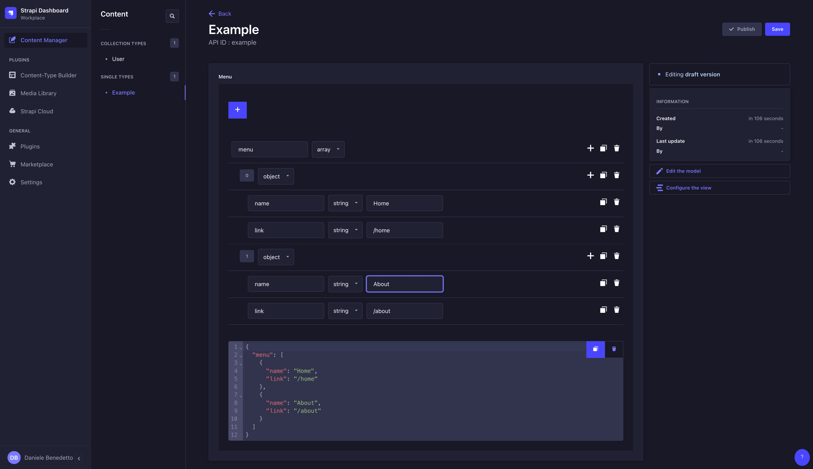

# Strapi Plugin Json Gui

A custom Strapi field designed for managing complex JSON structures through an intuitive graphical user interface.

## Installation

To install this plugin, add an NPM dependency to your Strapi application:

```
# Using Yarn
yarn add strapi-plugin-json-gui

# Or using NPM
npm i strapi-plugin-json-gui
```

Next, build your admin panel:

```
# Using Yarn
yarn build

# Or using NPM
npm run build
```

## Configuration

After installation, enable the plugin in your ./config/plugins.js file:

```js
module.exports = ({ env }) => ({
  // ...
  'strapi-plugin-json-gui': {
    enabled: true,
  },
  // ...
});
```

## Usage

Once installed and configured, you'll find a new field type in the content type builder.



You can then add the JSON schema for the field, allowing you to add/edit/clone/delete any valid JSON schema.



In this case, the API will return:

```json
{
  "data": {
    "id": 1,
    "attributes": {
      "menu": {
        "menu": [
          {
              "title": "Home",
              "url": "/home"
          },
          {
              "title": "About",
              "url": "/about"
          }
        ]
      }
    }
  }
}
```

### Bug Reporting and Contributions

I am committed to continuous improvement. If you come across any bugs, have suggestions, or want to request new features, please report them on [GitHub repository](https://github.com/daniele-benedetto/strapi-plugin-json-gui/issues). Your input is incredibly valuable and helps enhance the plugin for everyone.

## Upcoming Features in Development

1. **Drag and Drop for JSON Elements:** Implementing the ability to drag and drop elements within the JSON for a more intuitive management.

2. **Expanding and Collapsing Objects:** Introducing options to expand or collapse objects within the JSON, improving readability and data management.

3. **Limiting Edit Permissions for Specific Users:** Providing the capability to set editing restrictions for specific users, offering greater control over data access and management.

4. **Import and Export JSON:** Adding the ability to import and export JSON files, allowing for easier data management.

These features will soon be available in the next plugin update.
